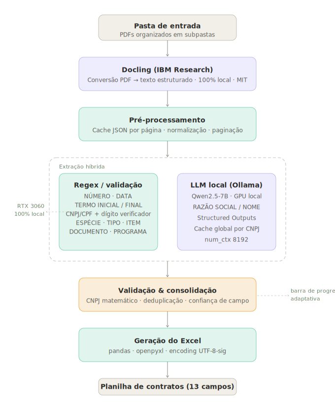

# Minerador de Contratos

Sistema local para extração automatizada de informações de contratos utilizando OCR e modelos de linguagem executados offline.

  

## Objetivo

Automatizar a identificação e extração de informações relevantes de contratos em vários formatos, reduzindo trabalho manual e aumentando a velocidade de análise documental.

## Tecnologias Utilizadas

- Python
- OCR
- Docling
- Ollama
- Qwen
- Processamento de PDFs

## Funcionalidades

- Processamento de documentos digitais
- Processamento de documentos escaneados
- OCR automático quando necessário
- Extração estruturada de dados
- Exportação para planilhas
- Processamento em lote

## Status do Projeto

Em desenvolvimento.

## Autor

Alysson Freire
